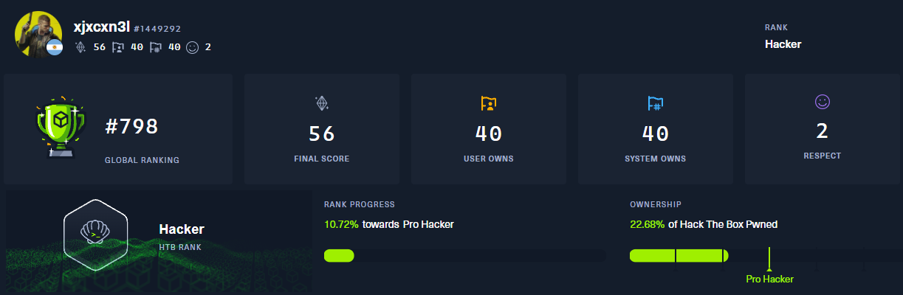

#### English

# Juan Cruz Lado - @Juancruzlado

## What's up! i'm Juan Cruz, currently a software developer 

I work 2 jobs as a Software Developer & App Architecture, and another as a fullstack dev for a startup. 
I love intellectual challenges to learn deeper & better, every learning oportunity is encouraged and appreciated!

### Interests & Learning

:seedling: Im currently embarqued in self-study of Golang, Python and Bash.
I love to venture into the lowest levels of code (c, assembly)
I also like to dabble into playing CTFs like HackTheBox, or TryHackme. 

### Hiring Status
Im open to new Job Opportunities! and looking for reasonable offers. Especially related to Backend of complex systems, or PenTesting/Red Team Cyber Security Activities, as well as AppSec.

### Current Personal Attributes 

My strongest attribute in programming is the backend in symfony projects, specifically when desigining testable services which interact with the model of the application to produce relevant data to be showcased in the CRUD part of the app. 
I'm a project leader right now, undergoing various lead efforts in building new webapps and APIs as well as maintaining old and complex systems with state machine like functionalities. I learned a lot about Docker, Databases, Networking, HTTP, Web Servers, API, Error handling and debugging, fixing production when it's down. Processing with async queries to maintain DBs and syncing it with Logic Filters on the State Machine which affects all private Services from the WebApp, etc. 
Also i'm part of an SSR team that manages Api Gateway, Authuentication and Architechture of our microservices. 
Linux is my preferred OS for Developing and Pentesting, due to how easy to use it is. I love Learning new stuff all the time and keeping up to date on the industry of information technology as a whole!  
My future interests would be definately related to low level stuff || Microservices && SRE activites || More Advanced Pen-Testing activities.
I'd also love to contribute to Open Source projects, find CVEs and contribute to making the internet a better place for everyone one day, when my skills back it up. 
I'm currently learning Golang as my second language. So PHP and Golang it is. My approach is to make lot's of projects.

 [My HackTheBox Profile if you're interested](https://app.hackthebox.com/users/1449292)

-----------------------------------------------------------------

#### Español

# Juan Cruz Lado - @Juancruzlado

## ¡Hola! Soy Juan Cruz, actualmente soy desarrollador de software.

Trabajo en 2 empleos, uno como Desarrollador de Software & Arquitectura de Apps , y otro como desarrollador fullstack para una startup. 
Me encantan los desafíos intelectuales para aprender  de manera más profunda y saber realmente el porque funciona todo, ¡cada oportunidad de aprendizaje va a ser alentada y apreciada!

### Intereses y Aprendizaje

:seedling: Actualmente en mi tiempo libre estoy embarcandome en el estudio de Golang, Python y Bash. Eventualmente me aventuro de vez en cuando en los niveles más bajos del código (C, ensamblador). También me gusta incursionar en jugar CTFs como [HackTheBox](https://app.hackthebox.com/users/1449292).

### Estado de Contratación

¡Estoy abierto a nuevas oportunidades laborales! y buscando ofertas razonables. Especialmente relacionadas con el backend de sistemas complejos, o actividades de PenTesting/Red Team de Ciberseguridad, así como AppSec.

### Atributos Personales Actuales

Mi atributo más fuerte en programación es el fullstack en proyectos Symfony, desarrollar scripts en Bash y herramientas o componentes de backend en Golang (Servers, una Shell, una herramienta de CLI para linux, etc), específicamente cuando diseño. Me interesa mucho el tema de la eficiencia como la seguridad de la información digital que involucre a cualquier persona Actualmente soy líder de algunos proyectos, realizando construcciones de nuevas aplicaciónes y páginas web, así como manteniendo sistemas antiguos y complejos. Aprendí mucho sobre Docker, bases de datos, redes, HTTP, servidores web, API, manejo de errores y debugging, solucionar problemas de producción cuando está caída, Procesamiento con consultas asíncronas para mantener bases de datos y sincronizarlas con filtros de lógica en la máquina de estados que afectan a todos los servicios privados de la aplicación web, etc. 
Linux es mi sistema operativo preferido para desarrollar programas y realizar PenTesting, debido a lo fácil que es de usar. ¡Me encanta aprender cosas nuevas todo el tiempo y mantenerme actualizado en la industria de la tecnología de la información en su conjunto! Mis intereses futuros definitivamente estarían relacionados con cosas de bajo nivel || Actividades de Microservicios y SRE || Actividades de Pen-Testing más avanzadas. También me encantaría contribuir a proyectos de código abierto, encontrar CVEs y contribuir a hacer de Internet un lugar mejor para todos. ¡Gracias por leer! 

